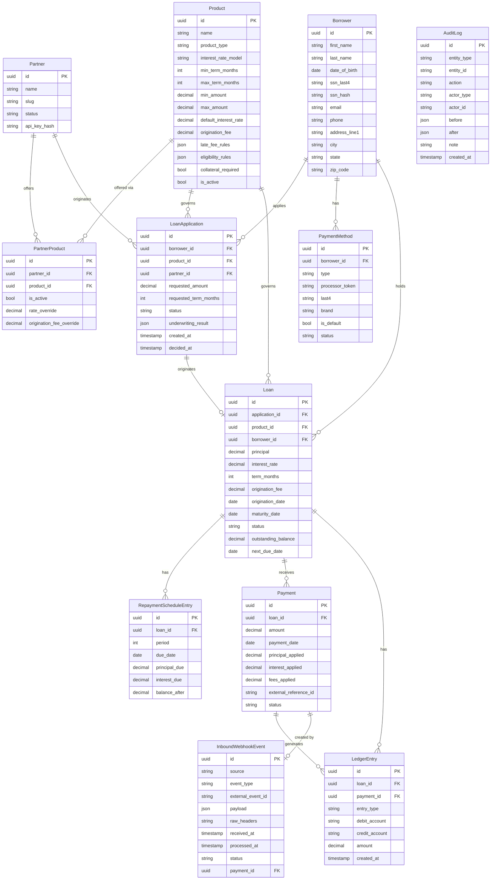

# Entity Relationship Diagram

> **Maintenance rule:** This diagram must be updated any time a model in `app/models/` changes — added tables, removed columns, new foreign keys, renamed fields. A PR that modifies a model file without a corresponding update to this diagram should not be merged.

## Tables

| Table | Description |
|---|---|
| `partners` | Businesses that offer financing products to their customers |
| `products` | Financing product definitions — rules, rates, limits |
| `partner_products` | Which products a partner may offer; holds per-partner rate/fee overrides |
| `borrowers` | End customers applying for financing |
| `payment_methods` | Tokenized payment instruments — no raw card/bank data stored |
| `loan_applications` | Applications submitted by partners on behalf of borrowers |
| `loans` | Active financing agreements created on application approval |
| `repayment_schedule_entries` | Month-by-month amortization schedule for each loan |
| `payments` | Payments applied to loans, sourced from processor webhook notifications |
| `inbound_webhook_events` | Append-only log of every inbound payment notification (idempotency key: `external_event_id`) |
| `ledger_entries` | Append-only double-entry ledger — disbursements, payments, fees, adjustments |
| `audit_log` | Append-only record of every significant system action |
